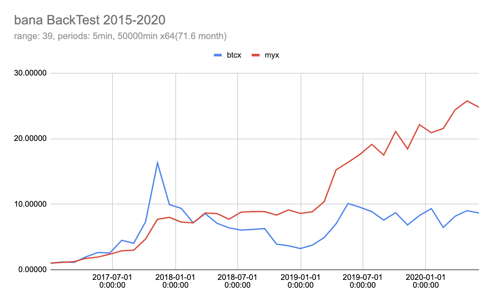
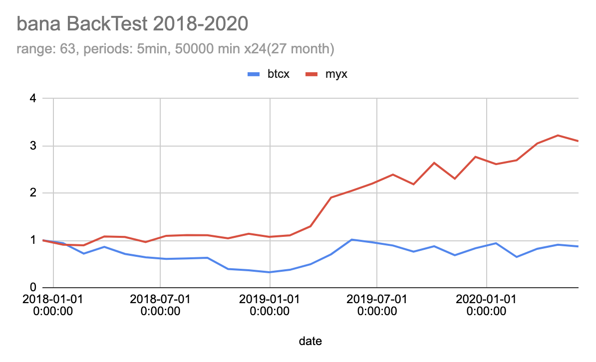

## otoro

otoro is BTC auto trading bot.  
単純に ChannelBreakOut をバックテストして良い結果が得られる定数を算出しています。

## version

### v.apple

Logic: Channel Breakout strategy, 5min range **756** (63 \* 12, 63 hours). 
2018〜2020 の BackTest では 34 日(50000 分)ごとに平均 3% の利回りがでています。  
[期間ごとのチャート](./img/backtest63)


<div style="display: flex;">


</div>


## make BackTest data

data source: https://api.bitcoincharts.com/v1/csv/bitflyerJPY.csv.gz  
初期は bitflyer でやっていましたが 2019 年のデータ抜け(2019-04〜2019-12)がひどいため coincheck のデータに切り替えています。  
抜けている期間についても大体同じ結果が得られています。

```
#  download
$ yarn download-tradedata-cc

#  unzip
$ unzip # coincheckJPY.csv.gz to coincheckJPY.csv

#  5分足ohlcデータ生成
$ python python make_data/convert_ohlc_cc.py
```

## Run backtest

```sh
$ LOGIC_PRINT= python myBackTest.py
```

```
if __name__ == "__main__":
    # main() # ログと結果の出力
    # range_backtest() # 「期間」「Channel幅」を網羅的にカンマ区切りで出力
```

```
log = False
plot = True # 画像の生成をするか？
logic_print = getenv("LOGIC_PRINT", True) # range_backtest で OFF 推奨

size_candle = 60 * 5
h = int(60 * 60 / size_candle)
channel_breakout_size = 63 * h

backtest_range = 100000
backtest_season = 3  # 0, 1, 2 ...
```
